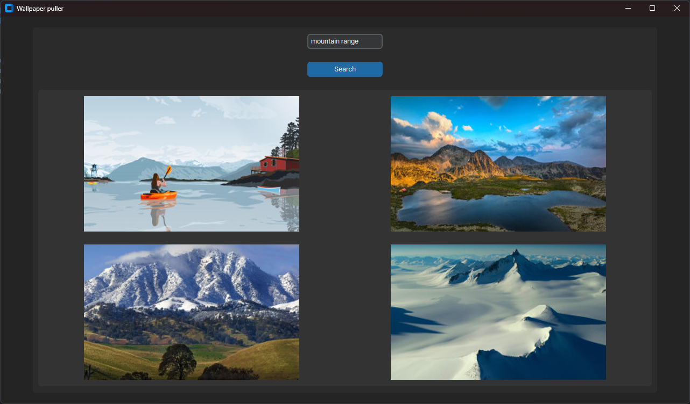

# Wallpaper application made using python with customtkinter

* pulls wallpapers from wallhaven.cc using wallhaven's API
* displays it onto a GUI and applies wallpaper to current windows desktop when clicked upon